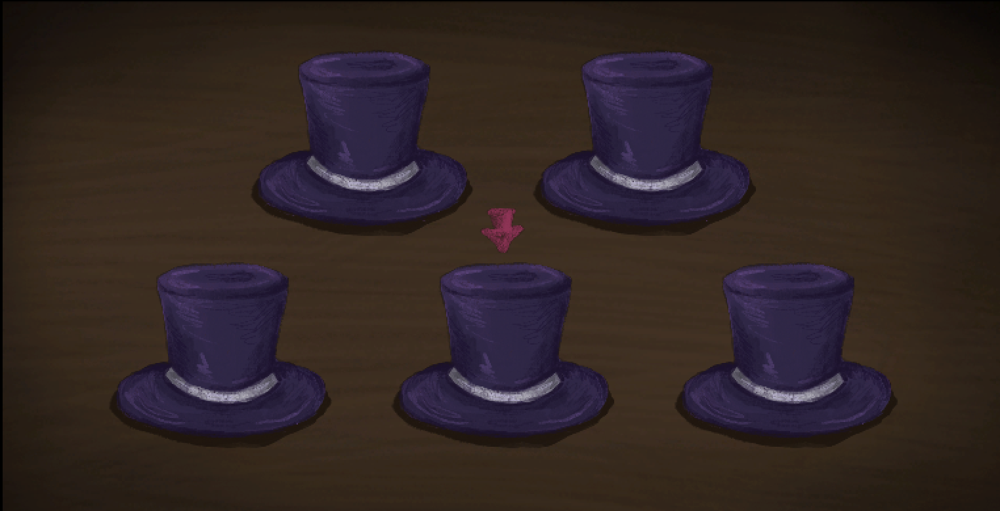
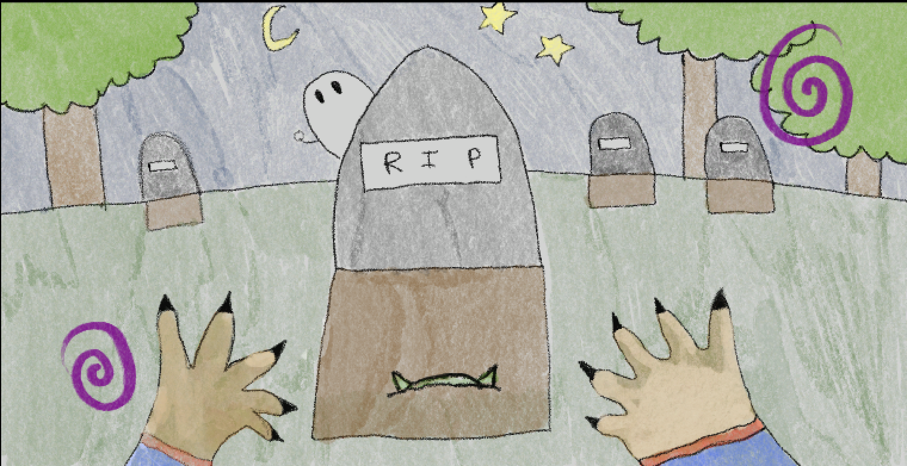

# No Cap & Zombiebara Minigames

This repo contains our minigames created for the UT Austin EGaDs Winter 2022 Mega Micro Jam using Unity and C#. 

**__Game Descriptions__**  

**No Cap**  
Attempt to find the capybara hidden underneath one of the hats at random within the time limit! Use
your arrow keys to select a hat and space to uncover what is underneath!  
 

**Zombiebara**  
Practice your necromancy to resurrect a capybara from the dead! Press space as fast as you can! 
 

**__Team Wombies__**  

**No Cap**  
* Eithan Austria - Programming
* Eriane Austria - Art

**Zombiebara**  
* Eithan Austria - Art
* Eriane Austria - Programming
